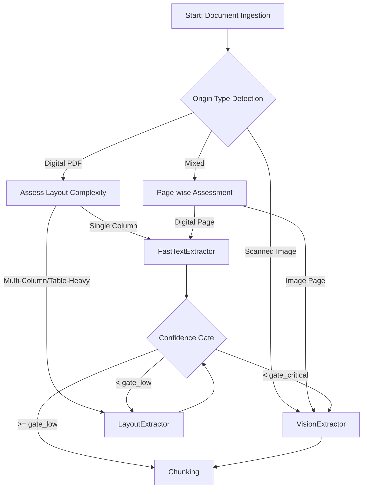
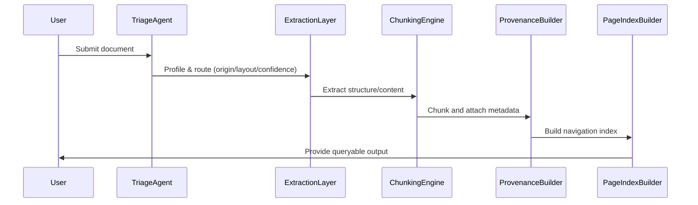

# DOMAIN_NOTES.md

## Strategy Decision Tree (Actual Implementation)

## Observed Failure Modes (From Corpus)
- Most documents are classified as `scanned_image` or `mixed` with very low character density (<< 0.12), triggering VisionExtractor or escalation.
- Financial domain hints are detected in some annual reports (e.g., "Tax Expenditure", "Amortization").
- All documents so far have `single_column` layout; no multi-column or table-heavy detected yet.
- Extraction confidence is often null or low, requiring robust escalation logic.
- Structure collapse and provenance blindness remain risks for scanned and mixed-origin documents.

## Pipeline Diagram (Implemented)

---

**Escalation Guard Triggers (Current Config):**
- If character density < 0.12, escalate to VisionExtractor.
- If image ratio > 0.35, escalate to VisionExtractor.
- If confidence < 0.85, escalate to LayoutExtractor.
- If confidence < 0.40, escalate to VisionExtractor.

*Thresholds and gates are dynamically loaded from rubric/extraction_rules.yaml and can be tuned without code changes.*
