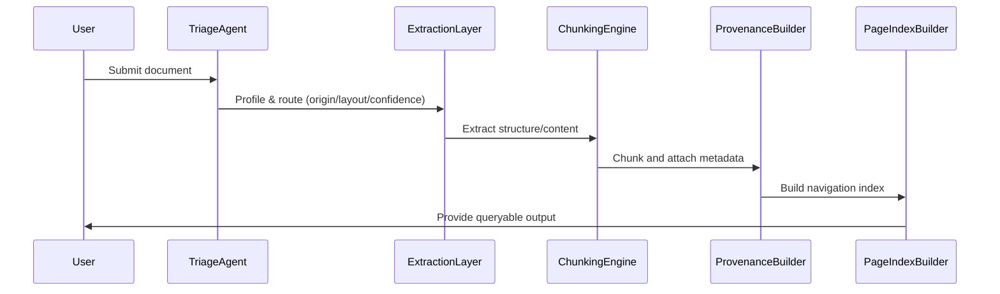

# DOMAIN_NOTES.md

## Strategy Decision Tree (Actual Implementation)

graph TD
    A[Start: Document Ingestion] --> B{Triage Agent}
    
    %% Classification Branch
    B -->|Analyze Metadata/Density| C{Origin Type?}
    
    C -->|Native Digital| D[Assess Layout Complexity]
    C -->|Scanned/Image| E[VisionExtractor Strategy C]
    C -->|Mixed| F[Split Pages]
    
    %% Digital Path
    D -->|Simple/Single Col| G[FastTextExtractor Strategy A]
    D -->|Complex/Tables| H[LayoutExtractor Strategy B]
    
    %% Mixed Path
    F -->|Digital Pages| D
    F -->|Image Pages| E
    
    %% The Escalation Guard (Confidence Gates)
    G --> G_Gate{Confidence?}
    G_Gate -->|>= gate_low| J[Semantic Chunking LDU]
    G_Gate -->|< gate_low| H
    
    H --> H_Gate{Confidence?}
    H_Gate -->|>= gate_critical| J
    H_Gate -->|< gate_critical| K{Budget Guard}
    
    %% Final Escalation
    K -->|Under Cap| E
    K -->|Over Cap| L[Fail & Log to Ledger]
    
    E --> J
    J --> M[PageIndex Builder]

## Observed Failure Modes (From Corpus)
- Most documents are classified as `scanned_image` or `mixed` with very low character density (<< 0.12), triggering VisionExtractor or escalation.
- Financial domain hints are detected in some annual reports (e.g., "Tax Expenditure", "Amortization").
- All documents so far have `single_column` layout; no multi-column or table-heavy detected yet.
- Extraction confidence is often null or low, requiring robust escalation logic.
- Structure collapse and provenance blindness remain risks for scanned and mixed-origin documents.

## Pipeline Diagram (Implemented)

---

**Escalation Guard Triggers (Current Config):**
- If character density < 0.12, escalate to VisionExtractor.
- If image ratio > 0.35, escalate to VisionExtractor.
- If confidence < 0.85, escalate to LayoutExtractor.
- If confidence < 0.40, escalate to VisionExtractor.

*Thresholds and gates are dynamically loaded from rubric/extraction_rules.yaml and can be tuned without code changes.*
